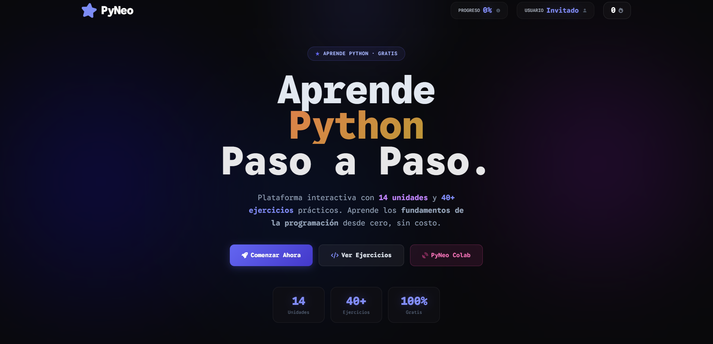
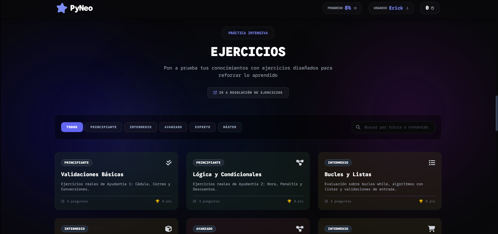

# 🚀 PyNeo — Plataforma Interactiva para Aprender Python

> **Aprende Python desde cero con lecciones interactivas, ejercicios prácticos, un editor de código en el navegador y gamificación.**

🔗 **Demo en vivo:** [https://py-neo.vercel.app/](https://py-neo.vercel.app/)

---

## 📖 Introducción

**PyNeo** es una plataforma educativa web diseñada para enseñar programación en Python de forma progresiva, interactiva y motivadora. Nació como proyecto universitario con el objetivo de resolver una problemática real: **la falta de herramientas en español que combinen teoría, práctica y motivación en un solo lugar**.

La plataforma está orientada a estudiantes sin experiencia previa en programación y guía al usuario desde los conceptos más básicos (¿qué es un algoritmo?) hasta temas avanzados como estructuras de datos, manejo de archivos y análisis de datos con Pandas, todo sin necesidad de instalar nada en su computador.

### ¿Qué hace especial a PyNeo?

- 🧠 **Aprendizaje progresivo:** 14 unidades temáticas ordenadas de menor a mayor dificultad.
- ⚡ **Editor Python en el navegador:** el estudiante escribe y ejecuta código real dentro de la misma lección (potenciado por [Skulpt](https://skulpt.org/) y [Pyodide](https://pyodide.org/)).
- 🔥 **Sistema de racha diaria:** motiva la práctica constante con un contador de días consecutivos de estudio y un sistema de "protectores de racha".
- 🏆 **Leaderboard:** tabla de clasificación global sincronizada en tiempo real con Firebase Firestore.
- 🎯 **Ejercicios evaluados:** retos de código con validación automática, temporizador y retroalimentación instantánea.
- 📱 **PWA (Progressive Web App):** instalable en dispositivos móviles y con soporte offline.
- 🔐 **Autenticación con Firebase:** progreso sincronizado en la nube entre dispositivos.

---

## 🛠️ Metodología Aplicada

### Arquitectura General

El proyecto sigue una arquitectura **Frontend puro (Vanilla)**, desplegado como sitio estático. No requiere un servidor backend propio; toda la lógica corre en el cliente y los datos se persisten en **Firebase** (BaaS).

```
PyNeo/
├── index.html          # App principal (lecciones + editor)
├── ejercicios.html     # Módulo de retos de código cronometrados
├── colab.html          # Sandbox/REPL Python libre
├── offline.html        # Página de soporte sin conexión
├── sw.js               # Service Worker (soporte PWA y caché offline)
├── manifest.json       # Configuración de PWA (instalable)
├── js/
│   ├── app.js          # Lógica principal: módulos, progreso, ejecución de Python
│   ├── streak.js       # Sistema de rachas diarias y desafío del día
│   ├── firebase-init.js # Inicialización de Firebase (auth, Firestore)
│   ├── chat.js         # Sistema de leaderboard y comunidad
│   ├── pyodide-worker.js # Worker para ejecutar Python con Pyodide
│   └── modules/        # Contenido de cada unidad temática
│       ├── unit_00.js  # Bienvenida a Python
│       ├── unit_01.js  # Variables y Tipos de Datos
│       ├── unit_02.js  # Operadores y Expresiones
│       ├── unit_03.js  # Condicionales (if/else)
│       ├── unit_04.js  # Bucles (for/while)
│       ├── unit_05.js  # Funciones
│       ├── unit_06.js  # Listas y Tuplas
│       ├── unit_07.js  # Diccionarios y Sets
│       ├── unit_08.js  # Manejo de Errores
│       ├── unit_09.js  # Archivos (lectura/escritura)
│       ├── unit_10.js  # Programación Orientada a Objetos
│       ├── unit_11.js  # Módulos y Librerías
│       ├── unit_12.js  # Comprensión de Listas
│       └── unit_13.js  # Análisis de Datos con Pandas
└── vercel.json         # Configuración de despliegue en Vercel
```

### Tecnologías Utilizadas

| Categoría | Tecnología |
|---|---|
| **Frontend** | HTML5, CSS3, JavaScript (ES6+) |
| **Estilos** | Tailwind CSS (CDN), JetBrains Mono (Google Fonts) |
| **Ejecución de Python** | Skulpt 1.2.0 (en lecciones), Pyodide (en Colab/sandbox) |
| **Base de datos** | Firebase Firestore (progreso del usuario, leaderboard) |
| **Autenticación** | Firebase Authentication |
| **Despliegue** | Vercel (producción), GitHub Pages (alterno) |
| **PWA** | Service Worker + Web App Manifest |
| **Iconos** | Font Awesome 6 |

### Flujo de una Lección

```
Usuario selecciona módulo
        ↓
Se carga el contenido HTML de la unidad (unit_XX.js)
        ↓
El usuario lee la teoría y puede probar código en el editor embebido
        ↓
Al ejecutar: Skulpt interpreta el código Python en el navegador
        ↓
Se valida la salida contra el resultado esperado (expectedOutput + matchType)
        ↓
Si es correcto: animación de éxito + progreso guardado en localStorage + sincronizado a Firestore
        ↓
Sistema de racha verifica si el usuario completó su práctica del día
```

### Sistema de Gamificación

El módulo `streak.js` implementa:
- **Racha diaria:** contador que se incrementa al completar al menos una lección por día. Se reinicia si el usuario falta un día.
- **Protector de racha (❄️):** consumible que evita perder la racha si el usuario falta un día.
- **Desafío del día:** ejercicio especial diario diferente cada 24 horas, sincronizado con Firestore.
- **Leaderboard global:** clasificación en tiempo real de todos los usuarios de la plataforma.

### Polyfills Personalizados

Dado que Skulpt no implementa todas las librerías de Python, se desarrollaron polyfills personalizados en JavaScript que emulan el comportamiento de:
- **`pandas`**: `DataFrame`, `Series` con soporte para operaciones estadísticas básicas (`.mean()`, `.std()`, `.max()`, `.min()`), filtrado booleano y selección de columnas.
- **Sistema de archivos virtual**: la función `open()` fue reimplementada para trabajar sobre objetos en memoria.

---

## ✅ Resultados

### Pantalla Principal — Lecciones Interactivas

La pantalla principal muestra el mapa de unidades y, al seleccionar una, despliega la lección con teoría, ejemplos y un editor de código integrado donde el usuario puede ejecutar Python directamente en el navegador.



> *Interfaz oscura con acento índigo (#6366f1) y verde neón. El editor embebido permite ejecutar código Python sin instalar nada.*

### Módulo de Ejercicios — Retos Cronometrados

La página de ejercicios (`/ejercicios.html`) presenta retos de código con niveles de dificultad (Principiante → Experto), un temporizador de cuenta regresiva y validación automática de la solución. Al resolver correctamente, se activa una animación de celebración y se actualiza el puntaje en el leaderboard.



> *Ejercicios organizados por temática y dificultad, con editor de código y retroalimentación en tiempo real.*

### Sandbox Python — Colab

La página `/colab.html` ofrece un entorno de programación libre similar a un Jupyter Notebook o Google Colab, donde el usuario puede escribir y ejecutar cualquier código Python (incluyendo pandas) sin restricciones. El motor de ejecución en esta sección es **Pyodide** (CPython compilado a WebAssembly), lo que permite una compatibilidad cercana al 100% con Python estándar.

### Logros del Proyecto

| Métrica | Resultado |
|---|---|
| Unidades temáticas | **14 módulos** (desde introducción hasta Pandas) |
| Lecciones interactivas | **+40 lecciones** con editor embebido |
| Ejercicios evaluados | **+30 retos** con validación automática |
| Soporte offline | ✅ (PWA + Service Worker) |
| Instalable como app | ✅ (Web App Manifest) |
| Sincronización en la nube | ✅ (Firebase Firestore + Auth) |
| Leaderboard en tiempo real | ✅ |
| Sistema de rachas | ✅ con protector de racha |

---

## 🚀 Cómo Ejecutar el Proyecto Localmente

```bash
# 1. Clonar el repositorio
git clone https://github.com/Neosowo/PyNeo.git
cd PyNeo

# 2. Instalar dependencias (solo Vite como servidor de desarrollo)
npm install

# 3. Iniciar el servidor de desarrollo
npm run dev

# 4. Abrir en el navegador
# http://localhost:5173
```

> **Nota:** No se requiere configuración adicional. El proyecto usa Firebase con claves públicas ya integradas.

---

## 👤 Autor

Desarrollado por **Erick Yánez**

- 🌐 Demo: [https://py-neo.vercel.app/](https://py-neo.vercel.app/)
- 💻 GitHub: [github.com/Neosowo/PyNeo](https://github.com/Neosowo/PyNeo)

---


